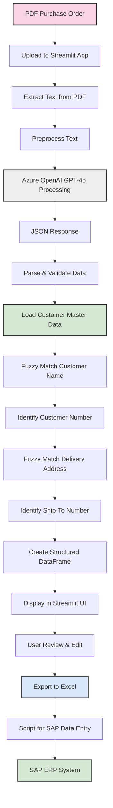
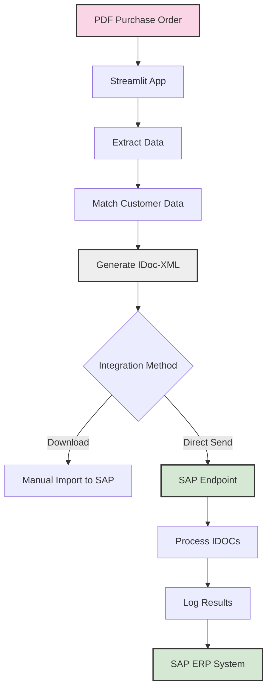

# Streamlit PDF Purchase Order Extractor for SAP Integration

A Streamlit-based web application for extracting and processing purchase order information from PDF documents. This application uses Azure OpenAI's GPT-4o model to intelligently extract key information from purchase order PDFs, match it with customer master data, and export it in a format ready for SAP ERP data entry via EDI integration or scripting.

**Try the deployed application here: [https://poextrationopenai.streamlit.app/](https://poextrationopenai.streamlit.app/)**

## Azure OpenAI Integration

This application leverages Azure OpenAI Services rather than the standard OpenAI API, providing several advantages:

- **Data Residency & Sovereignty**: Keep your data within specific geographic regions to meet compliance requirements
- **Enterprise Security**: Leverage Azure's enterprise-grade security features, including private networking options
- **Compliance**: Meet regulatory requirements with Azure's comprehensive compliance certifications
- **Azure Integration**: Seamlessly integrate with other Azure services (Storage, Databases, Identity, etc.)
- **SLAs**: Enterprise-grade service level agreements for production workloads
- **Cost Management**: Manage costs through your existing Azure subscription and budgeting tools
- **Content Filtering**: Additional content filtering options and controls

Key configuration details:
- **Azure Endpoint**: The application connects to your Azure OpenAI deployment endpoint
- **Deployment Name**: Uses your specific model deployment in Azure OpenAI (default: gpt-4o)
- **API Version**: Uses the Azure OpenAI API version 2024-02-01

## Business Value

This application streamlines the purchase order processing workflow by:

1. **Eliminating Manual Data Entry**: Automatically extracts key information from PDF purchase orders
2. **Enhancing Data Accuracy**: Uses fuzzy matching to correctly identify customer and ship-to information
3. **Simplifying SAP Integration**: Exports data in Excel format ready for VBS scripting to perform data entry into SAP ERP
4. **Reducing Technical Overhead**: No need to set up SAP endpoint programs or EDI connections
5. **Empowering Business Users**: Allows internal business teams to operate this process without IT intervention

The primary purpose of this tool is to bridge the gap between received PDF purchase orders and SAP ERP data entry, enabling a streamlined workflow that can be managed internally by business teams.

## Overview

This project has been modularized for better maintainability and consists of the following components:

1. **app.py**: The main Streamlit application entry point
2. **utils.py**: Utility functions for PDF processing and display
3. **data_processing.py**: Functions for data transformation and handling
4. **api.py**: Azure OpenAI API integration
5. **session_state.py**: Session state management
6. **ui_components.py**: UI components and layout
7. **processing.py**: Core processing logic
8. **prompts.py**: Prompt engineering for Azure OpenAI API

## Application Structure

The application follows a modular architecture for better maintainability:

### Main Application (app.py)
```python
import streamlit as st
from session_state import initialize_session_state
from ui_components import create_sidebar, display_data_and_downloads
from processing import process_files
from api import validate_api_key

# Set Streamlit Page Layout
st.set_page_config(page_title="📄 LLM-Powered Purchase Order Extractor", layout="wide")

# Initialize session state variables
initialize_session_state()

# Sidebar: API Key and File Upload
openai_api_key, process_clicked = create_sidebar(validate_api_key)

# Processing Logic (Only runs when Process is clicked)
if st.session_state.api_key_valid and st.session_state.uploaded_files_list and st.session_state.processed:
    # Process the files and store results in session state
    extracted_data = process_files(st.session_state.uploaded_files_list, openai_api_key)
    st.session_state.extracted_data = extracted_data

# Display data and download options
edited_df = display_data_and_downloads()

```

### Module Responsibilities

1. **utils.py**: Contains utility functions for PDF text extraction and number formatting
   - `extract_text_from_pdf()`: Extracts text from PDF files
   - `fix_number_format()`: Standardizes number formats

2. **data_processing.py**: Handles data transformation and processing
   - `convert_to_dataframe()`: Converts extracted data to pandas DataFrame
   - `process_api_response()`: Processes and cleans API responses

3. **api.py**: Manages Azure OpenAI API interactions
   - `validate_api_key()`: Validates the Azure OpenAI API key
   - `extract_data_from_text()`: Calls the Azure OpenAI API with the provided text

4. **session_state.py**: Manages Streamlit session state
   - `initialize_session_state()`: Sets up initial session state variables
   - `reset_session_state()`: Resets session state variables

5. **ui_components.py**: Contains UI components and layout functions
   - `create_sidebar()`: Creates the sidebar with API key input and file upload
   - `display_data_and_downloads()`: Displays data and download options

6. **processing.py**: Contains the core processing logic
   - `process_files()`: Processes uploaded files and extracts data

7. **prompts.py**: Contains prompt engineering for Azure OpenAI API
   - `get_system_message()`: Returns the system message for the Azure OpenAI API
   - `get_multi_line_prompt()`: Returns the multi-line prompt for the Azure OpenAI API
   - `create_prompts()`: Creates the prompts for the Azure OpenAI API

## How It Works: Azure OpenAI-Powered Extraction

This system leverages Azure OpenAI's GPT-4o model to extract relevant information from purchase order documents through a streamlined process:

### 1. Text Extraction

```python
def extract_text_from_pdf(pdf_file):
    text = ""
    try:
        pdf_reader = PyPDF2.PdfReader(pdf_file)
        for page in pdf_reader.pages:
            text += page.extract_text() + "\n"
    except Exception as e:
        st.error(f"Error reading PDF: {e}")
    return text
```

- The system extracts raw text from PDF documents using PyPDF2
- All pages of the PDF are processed and combined into a single text string

### 2. Text Preprocessing

```python
def fix_number_format(text):
    text = re.sub(r'(\d{1,3}),(\d{3}\.\d+)', r'\1\2', text)  # Convert "41,976.050" → "41976.050"
    return text
```

- The extracted text undergoes preprocessing to fix common formatting issues
- Number formats are standardized to ensure accurate extraction

### 3. Azure OpenAI API Integration

```python
client = AzureOpenAI(
    api_key=openai_api_key,
    api_version=AZURE_API_VERSION,
    azure_endpoint=AZURE_ENDPOINT
)

response = client.chat.completions.create(
    model=AZURE_DEPLOYMENT,
    messages=prompts,
    temperature=0,
    top_p=0
)
```

- The preprocessed text is sent to Azure OpenAI's GPT-4o model
- A carefully crafted system prompt guides the model to extract specific fields
- Temperature is set to 0 for deterministic outputs

### 4. Information Extraction

The system prompt instructs the model to extract:
- Customer Name (from the 'SHIP TO' section)
- Purchase Order Number
- Required Delivery Date (converted to ISO format)
- Material Number
- Order Quantity in kg (standardized format)
- Delivery Address (only the 'SHIP TO' address)

### 5. JSON Parsing and Validation

```python
try:
    extract_contents_json = json.loads(extract_contents)
except json.JSONDecodeError:
    st.error("⚠ OpenAI returned invalid JSON")
```

- The model's response is parsed as JSON
- Validation ensures the extracted information is properly structured
- Error handling manages cases where the model doesn't return valid JSON

## Streamlit Frontend Features

The Streamlit application provides a user-friendly interface with the following features:

### 1. API Key Management

- Secure input for Azure OpenAI API key
- Validation to ensure the API key is valid
- Session state management to maintain the key during the session

### 2. File Upload

- Support for multiple PDF uploads
- File validation to ensure only PDFs are processed
- Session state management to track uploaded files

### 3. Processing Controls

- Process button to trigger extraction
- Reset button to clear uploaded files and results
- Visual feedback during processing

### 4. Results Display

- Structured display of extracted information
- Data editing capabilities
- Export options for CSV and Excel

## Prerequisites

- Python 3.7+
- Streamlit
- PyPDF2
- Azure OpenAI Python SDK
- pandas
- python-dotenv (for openAI_extraction.py)
- Valid Azure OpenAI API key with access to GPT-4o

## Installation

1. Clone the repository:
   ```
   git clone <repository-url>
   cd <repository-directory>
   ```

2. Install required dependencies:
   ```
   pip install -r requirements.txt
   ```

3. For openAI_extraction.py, create a .env file with your Azure OpenAI API key:
   ```
   AZURE_API_KEY=your_api_key_here
   ```

## Usage

### Running the Streamlit App

```
streamlit run app.py
```

The application will open in your default web browser, typically at http://localhost:8501.

### Using the Application

1. Enter your Azure OpenAI API key in the sidebar
2. Click "Validate API Key" to verify the key
3. Upload one or more PDF purchase orders
4. Click "Process Files" to extract information
5. View the structured results for each file
6. Use "Reset Files" to clear and start over

### Running the Backend Script Directly

```
python openAI_extraction.py
```

Note: The backend script is configured to process a specific file (4700414082.pdf). Modify the script to process different files.

## System Architecture

The following diagram illustrates the end-to-end process flow of the application:



This diagram shows how the system processes purchase orders from PDF upload through to SAP data entry, highlighting the key role of customer data matching and Excel export for VBS scripting.

## Customer Data Management

### 1. Customer Master Data Conversion

The application includes a utility script (`update_customer_master.py`) to convert customer master data from Excel to JSON format:

```python
# Load the Excel file
file_path = "customer master.xlsx"
df = pd.read_excel(file_path)

# Normalize 'Customer Number' (strip spaces and convert to uppercase)
df["Customer Number"] = df["Customer Number"].astype(str).str.strip().str.upper()

# Fill empty 'Customer Name' downward to ensure each row has a name
df["Customer Name"] = df["Customer Name"].fillna(method="ffill")

# Convert DataFrame to JSON-like dictionary
customer_dict = {}

for _, row in df.iterrows():
    cust_num = row["Customer Number"]
    cust_name = row["Customer Name"]
    ship_to_num = row["Ship-To Number"]
    ship_to_addr = row["Ship-To Address"]

    if cust_num not in customer_dict:
        customer_dict[cust_num] = {
            "customer_names": set(),  # Using a set to handle multiple names
            "ship_to": {}
        }

    customer_dict[cust_num]["customer_names"].add(cust_name)

    if pd.notna(ship_to_num) and pd.notna(ship_to_addr):
        customer_dict[cust_num]["ship_to"][ship_to_num] = ship_to_addr

# Convert sets to lists for JSON serialization
for cust_num in customer_dict:
    customer_dict[cust_num]["customer_names"] = list(customer_dict[cust_num]["customer_names"])
```

This script:
- Loads customer data from an Excel file
- Normalizes customer numbers and names
- Handles multiple customer names for the same customer number using sets to avoid duplicates
- Organizes ship-to addresses by customer number
- Converts the data to a JSON structure and saves it to `customer_master_data.json`

To update the customer master data:
1. Update the "customer master.xlsx" file with the latest customer information
2. Run the script: `python update_customer_master.py`
3. The updated `customer_master_data.json` file will be used by the application

### 2. Customer Data Structure

The system uses a JSON file (`customer_master_data.json`) containing customer information:
- Customer numbers
- Customer names (stored as lists to support multiple name variations)
- Ship-to locations and their corresponding numbers

### 3. Fuzzy Matching Process

```python
def find_customer_number(customer_name, customer_master_data):
    # Create a dictionary mapping customer names to customer numbers
    customer_dict = {}
    for cust_num, data in customer_master_data.items():
        if 'customer_names' in data:  # Check if using the plural 'customer_names' field
            # Handle list of customer names
            for name in data['customer_names']:
                customer_dict[name] = cust_num
        elif 'customer_name' in data:  # Backward compatibility for singular 'customer_name'
            customer_dict[data['customer_name']] = cust_num
    
    # Use fuzzy matching to find the best match
    best_match = process.extractOne(customer_name, customer_dict.keys())
    
    # If match score is above threshold
    if best_match and best_match[1] >= 70:  # 70% match threshold
        matched_customer_name = best_match[0]
        customer_number = customer_dict[matched_customer_name]
        return customer_number, matched_customer_name
    
    return None, None
```

- The system uses fuzzy string matching to compare extracted customer names with the master data
- This handles variations, abbreviations, and minor differences in naming conventions
- Once a customer is identified, the system can retrieve the appropriate ship-to information

### 4. Ship-To Number Identification

```python
def find_ship_to_number(customer_number, delivery_address, customer_master_data):
    # Get ship_to data for the customer
    customer_data = customer_master_data.get(customer_number)
    if not customer_data or 'ship_to' not in customer_data:
        return None
    
    ship_to_dict = customer_data['ship_to']
    
    # Create a dictionary mapping addresses to ship_to numbers
    address_dict = {address: ship_num for ship_num, address in ship_to_dict.items()}
    
    # Use fuzzy matching to find the best match
    best_match = process.extractOne(delivery_address, address_dict.keys())
    
    # If match score is above threshold
    if best_match and best_match[1] >= 60:  # 60% match threshold for addresses
        matched_address = best_match[0]
        return address_dict[matched_address]
    
    return None
```

- After identifying the customer, the system uses fuzzy matching to find the correct ship-to location
- This enables accurate identification of the ship-to number required for SAP data entry

## SAP Integration Options

The application provides three methods for integrating with SAP:

### 1. Excel Export for VBS Scripting

The primary purpose of exporting data to Excel is to facilitate SAP ERP data entry through VBS scripting:

1. **VBS Scripting Integration**: The exported Excel file is structured to be compatible with VBS scripts that automate data entry into SAP
2. **No Direct SAP Connection Required**: This approach eliminates the need for complex SAP endpoint programming or EDI connections
3. **Business User Empowerment**: Non-technical users can run the process end-to-end without IT support

#### Excel Export Format

The Excel export includes all extracted fields plus the matched customer and ship-to information:
- Customer Number (matched from master data)
- Ship To Number (matched from master data)
- Purchase Order Number
- Required Delivery Date
- Customer Part Number (renamed from Material Number)
- Order Quantity (renamed from Order Quantity in kg)
- Other extracted fields

This format provides all the necessary information for VBS scripts to perform automated data entry into SAP.

### 2. ANSI X12 850 Format for SAP Integration

For more direct integration with SAP, the application can generate data in the ANSI X12 850 (Purchase Order) standard format:

1. **Standard Compliance**: Follows the ANSI X12 850 (Purchase Order) standard structure
2. **SAP Integration Ready**: The generated file follows the format needed for SAP integration
3. **Structured Data Format**: Organizes data into standard segments for reliable processing

#### ANSI X12 850 Structure

The generated file follows the standard ANSI X12 850 EDI format with the following segments:

```
ST*850*0001                 (Transaction Set Header)
BEG*00*SA*PO12345**20250319 (Beginning of Purchase Order)
N1*ST**92*SHIP456           (Ship-To Information)
N1*BY**92*CUST123           (Buyer/Customer Information)
DTM*002*20250325            (Required Delivery Date)
PO1*1*50*KG***BP*PARTXYZ    (Purchase Order Line Item)
CTT*1                       (Transaction Totals)
SE*7*0001                   (Transaction Set Trailer)
```

Each segment serves a specific purpose:
1. **ST**: Identifies the start of an 850 transaction set
2. **BEG**: Contains purchase order type, PO number, and date
3. **N1**: Name segments for ship-to and buyer information
4. **DTM**: Date/time reference for required delivery
5. **PO1**: Line item details including quantity, unit of measure, and part number
6. **CTT**: Transaction totals (number of line items)
7. **SE**: End of transaction set with segment count

#### Using the ANSI X12 850 Feature

To generate and download an ANSI X12 850 format file:

1. Process your PDF purchase orders as normal
2. Review and edit the extracted data if needed
3. Click the "Download ANSI X12 850" button
4. Use the downloaded file with your SAP integration processes

Each row in the DataFrame is processed as a separate EDI transaction, making it suitable for both single and multi-line purchase orders. The generated file follows the standard EDI X12 850 format that can be directly used with SAP and other EDI-compatible systems.

### 3. IDoc-XML Format for SAP Integration

For direct integration with SAP's IDoc (Intermediate Document) system, the application can generate IDoc data in XML format:

1. **SAP IDoc Standard**: Follows the SAP IDoc structure for purchase orders
2. **XML Format**: Uses XML for better compatibility with modern systems
3. **Direct SAP Import**: The generated XML file can be imported into SAP systems
4. **Direct Transmission**: Send IDoc-XML data directly to SAP endpoints

#### Using the IDoc-XML Feature

To generate and download an IDoc-XML file:

1. Process your PDF purchase orders as normal
2. Review and edit the extracted data if needed
3. Click the "Download IDoc-XML" button
4. Import the downloaded XML file into your SAP system

Each row in the DataFrame is processed as a separate IDoc record within the XML file, making it suitable for both single and multi-line purchase orders.

### 4. Direct SAP Endpoint Integration and Testing

The application includes a built-in SAP endpoint simulator for testing IDoc-XML transmission:

1. **Local SAP Endpoint**: A Python-based HTTP server that simulates a SAP endpoint
2. **Direct Transmission**: Send IDoc-XML data directly to SAP systems
3. **Comprehensive Logging**: Detailed logging of all transmitted data
4. **Testing Environment**: Test SAP integration without a real SAP system

#### SAP Endpoint Simulator (sap_endpoint.py)

The application includes a SAP endpoint simulator (`sap_endpoint.py`) that can be used to test the IDoc-XML transmission:

```python
# Start the SAP endpoint simulator
python sap_endpoint.py
```

This will start a local HTTP server on port 8000 that simulates a SAP endpoint. The server will:
1. Receive IDoc-XML data via HTTP POST requests
2. Parse and validate the XML data
3. Extract key information from each IDOC
4. Log the complete XML and processing details
5. Return a success/failure response

#### Logging and Monitoring

The SAP endpoint simulator provides comprehensive logging:

1. **Complete XML Logging**: The entire XML document is saved to `sap_endpoint_xml.log`
2. **Processing Details**: Detailed information about each IDOC is logged to `sap_endpoint.log`
3. **IDOC Structure**: The complete structure of each IDOC is logged
4. **Key Fields**: Important fields like PO Number, Customer, Part Number, Quantity, etc. are extracted and logged

#### Testing SAP Integration

To test the SAP integration:

1. Start the SAP endpoint simulator:
   ```
   python sap_endpoint.py
   ```

2. Process your PDF purchase orders in the main application

3. Click the "Send to SAP" button to transmit the IDoc-XML data to the local SAP endpoint

4. Check the logs to verify the transmission:
   - `sap_endpoint_xml.log`: Contains the complete XML document
   - `sap_endpoint.log`: Contains detailed processing information

This testing environment allows you to verify that your IDoc-XML data is correctly formatted and can be properly processed by a SAP system, without requiring access to a real SAP environment.

#### SAP Integration Architecture

The following diagram illustrates the SAP integration architecture:



This diagram shows how the system integrates with SAP, highlighting both the manual import option and the direct transmission option using the SAP endpoint.

## Extending the Application

To further enhance the application:

1. **Add Authentication**: Implement user authentication for secure access
2. **Database Integration**: Store extracted information and processing history
3. **Custom Extraction Rules**: Add support for different purchase order formats
4. **Enhanced SAP Integration**: Develop more sophisticated VBS scripts for complex SAP transactions
5. **Batch Processing Improvements**: Add progress tracking for large batches
6. **Additional Master Data**: Expand master data matching to include materials, pricing, etc.
7. **Validation Rules**: Implement business rules to validate extracted data before SAP entry
8. **Approval Workflow**: Add approval steps before data is exported for SAP entry
